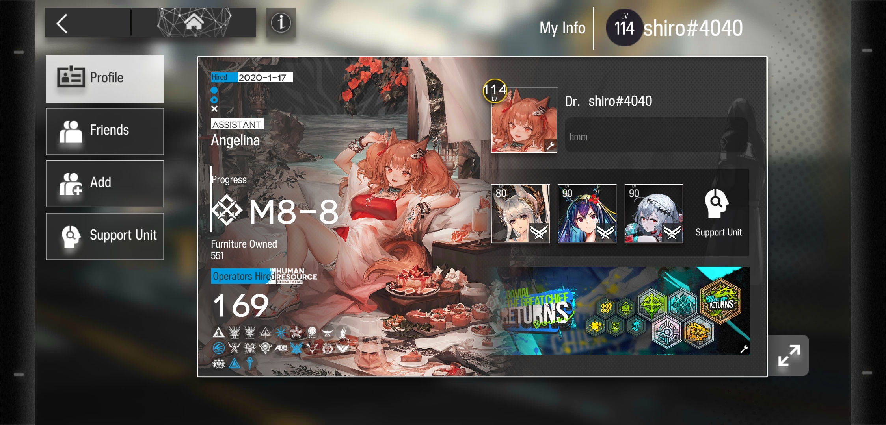

<h2 align="center">Hi, Everyone :wave:</h2>

I'm Galih Redha Saputra. A person who likes code and technology, most of his life is spent on it :smile:. I like to create projects in the field of web development. I am interested in making websites much more beautiful and attractive, implementing clean code, and orchestrating the flow of a business. I hope that my projects will be useful for many people.

<h3 align="left">Tech Stack</h3>

:diamond_shape_with_a_dot_inside:	Frontend

  

    
    
    
    
    
    
  

:diamond_shape_with_a_dot_inside:	Backend

  

    
    
    
    
  

:diamond_shape_with_a_dot_inside:	Tools

  

    
    
    
    
    
  

<h3 align="left">You can reach me in here</h3>
  

    
    
    
  

Primary Game

  <a href=https://play.google.com/store/apps/details?id=com.YoStarEN.Arknights&hl=in&gl=US" target="_blank">Arknights (EN)</a>
  
| <b>ID : shiro#4040</b> | The One And Only My Game :smile:

  

Stats Github

  
  
  
  

Programming Languages

  
  
  

